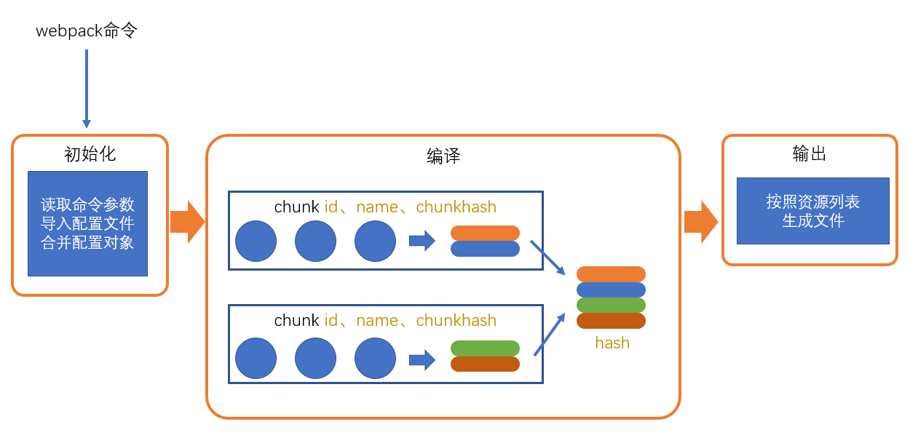
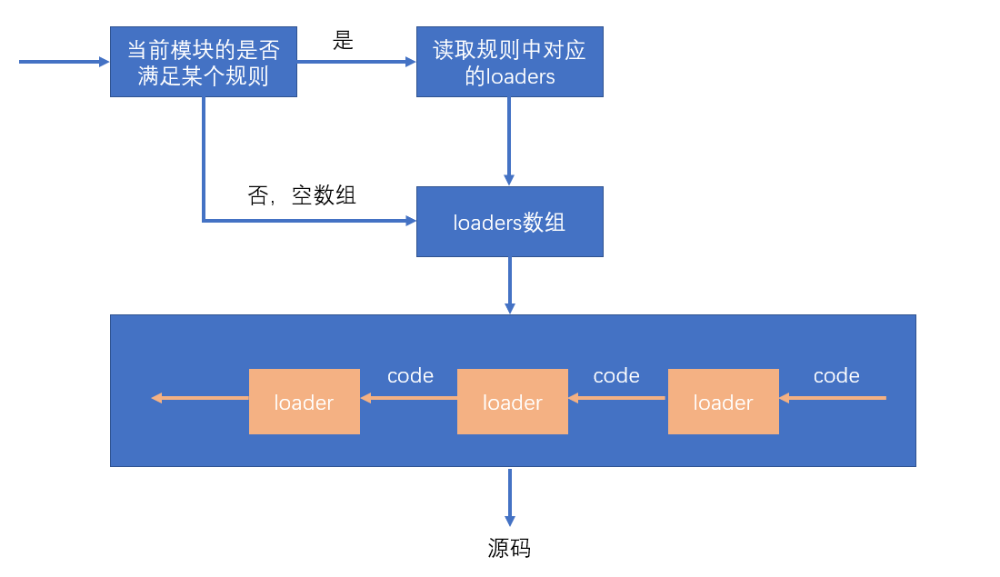

[什么是前端工程化](https://zhuanlan.zhihu.com/p/467554489)

# 4. webpack 工作流程

> 在 webpack 世界中，编译过程中存在两个核心对象：
>
> - 负责整体编译流程的 `Compiler`对象
> - 负责编译 Module 的`Compilation`对象
>
> 围绕着两个配套的生态 ：
>
> - Loader
>
> - Plugin
>
> Plugin 的本质上基于 Tapable 这个库去实现的。Tapable 提供了一系列事件的发布订阅 API ，通过 Tapable 我们可以注册事件，从而在不同时机去触发注册的事件进行执行。

## 1. 初始化参数阶段

**配置文件读取与合并参数，得出最终的参数：**

从配置文件`webpack.config.js`中读取对应的配置参数和 `shell` 命令中传入的参数进行与默认参数合并，得到最终打包的配置参数。

## 2. 开始编译准备阶段

**用得到的参数初始化 Compiler 对象，加载所有配置的插件，开始执行编译：**

这一步我们会通过调用`webpack()`方法返回一个 `compiler`方法，创建我们的`compiler`对象，并且注册各个`Webpack Plugin`。找到配置入口中的`entry`代码，调用`compiler.run()`方法进行编译。

## 3. 模块编译阶段

**从入口文件出发，调用所有配置的`Loader`对模块进行翻译，同时分析模块依赖的模块，递归进行模块编译工作。**

## 4. 完成编译阶段

**在经过 Loader 翻译完所有模块后，得到了每个模块被翻译后的最终内容以及他们之间的依赖关系**

## 5. 输出文件阶段

**整理模块依赖关系，同时将处理后的文件输出到`output`的磁盘目录中：**

根据入口和模块之间的依赖关系，组装成一个个包含多个模块的 Chunk，再把每个 Chunk 转换成一个单独的文件加入到输出列表，这步是可以修改输出内容的最后机会，在确定好输出内容后，根据配置确定输出的路径和文件名，把文件内容写入到文件系统。

# 5. 什么是 loader，什么是 Plugin

## 5.1 loader 直译为“加载器”

webpack 将一切文件视为模块，但是 webpack 原生是只能解析 js 文件，如果想将其他文件也打包的话，就会用到 loader。

作用：让 webpack 拥有了加载和解析非 JavaScript 文件的能力。

## 5.2 Plugin 直译为“插件”

Plugin 可以扩展 webpack 的功能，让 webpack 具有更多的灵活性。在 webpack 运行的生命周期中会广播出许多事件，Plugin 可以监听这些事件，在合适的时机通过 webpack 提供的 API 改变输出结果。

## 5.3 区别

- Loader 本质就是一个函数，在该函数中对接收到的内容进行转换，返回转换后的结果。因为 webpack 只认知 JavaScript，所以 Loader 就成了翻译官，对其他类型的资源进行转译的预处理工作。
- Plugin 就是插件，基于事件流框架 Tapable。插件可以扩展 webpack 的功能，在 webpack 运行的生命周期中会广播出许多事件，plugin 可以监听这些事件，在合适的时机通过 webpack 提供的 API 改变输出结果。
- Loader 在 `module.rules` 中配置，作为模块的解析规则，类型为数组。每一项都是一个 Object，内部包含了 test（正则匹配的文件类型）、loader（所使用的 loader）、options（参数）等属性。
- Plugin 在 plugins 中单独配置，类型为数组，每一项是一个 Plugin 的实例，参数都通过构造函数传入。

# 6. 用过哪些 Loader?

# 7. 打包效率

量化：`speed-measure-webpack-plugin`
缩小转译范围：`exclude/include`
缓存技术：`cache-loader`
并行处理：`Happypack`
`noparse`：

> 如果一些第三方模块没有 AMD/CommonJS 规范版本，可以使用 noParse 来标识这个模块，这样 Webpack 会引入这些模块，但是不进行转化和解析，从而提升 Webpack 的构建性能，例如：jquery、lodash

```js
module.exports = {
  module: {
    noParse: /jquery|lodash/,
  },
};
```

`scope hosting` 作用域提升

# 8 提高页面性能

- 压缩代码：删除多余的代码、注释、简化代码的写法等方式。可以利用 webpack 的 UglifyJsPlugin 和 ParallelUglifyPlugin 来压缩 JS 文件，利用 cssnano（css-loader?minimize）来压缩 css
- 利用 CDN 加速：在构建过程中，将引用的静态资源路径修改为 CDN 上对应的路径。可以利用 webpack 对于 output 参数和各 loader 的 publicPath 参数来修改资源路径
- Tree Shaking：（前提是静态加载）将代码中永远不会走的片段删掉。可以通过在启动 webpack 时追加参数 --optimize-minimize 来实现
- Code Splitting：将代码按路由维度或者组件分块（chunk），这样做到按需加载，同时可以充分利用浏览器缓存
- 提取公共第三方库：SplitChunksPlugin 插件来进行公共模块抽取，利用浏览器缓存可以长期缓存这些无需频繁变动的公共代码
- scope hosting 作用域提升：变量提升，可以减少一些变量声明。在生产环境下，默认开启

1. 有哪些常见的 Loader，用过哪些

   1. raw-loader：加载文件原始内容
   2. file-loader：把文件输出到一个文件夹中，在代码中通过相对 URL 去引用输出的文件（处理图片和字体）
   3. url-loader：与 file-loader 类似，区别是用户可以设置一个阈值，大于阈值会交给 file-loader 处理，小于阈值时返回文件 base64 形式编码（处理图片和字体）
   4. source-map-loader：加载额外的 Source Map 文件，以方便断点调试
   5. svg-inline-loader：将压缩后的 SVG 内容注入代码中
   6. image-loader：加载并且压缩图片文件
   7. json-loader：加载 JSON 文件（默认包含）
   8. babel-loader：把 ES6 转换成 ES5
   9. ts-loader：将 TypeScript 转换成 JavaScript
   10. awesome-typescript-loader：将 TypeScript 转换成 JavaScript，性能优于 ts-loader
   11. sass-loader：将 SCSS/SASS 代码转换成 CSS
   12. css-loader：加载 CSS，支持模块化、压缩、文件导入等特性
   13. style-loader：把 css 代码注入到 JavaScript 中，通过 DOM 操作去加载 CSS
   14. postcss-loader：扩展 CSS 语法，使用下一代 CSS，可以配合 autoprefixer 插件自动补齐 CSS3 前缀
   15. eslint-loader：通过 ESLint 检查 JavaScript 代码
   16. tslint-loader：通过 TSLint 检查 TypeScript 代码

2. 有哪些常见的 Plugin，用过哪些

   1. define-plugin：定义环境变量（Webpack4 之后指定 mode 会自动配置）
   2. ignore-plugin：忽略部分文件
   3. html-webpack-plugin：简化 HTML 文件创建（依赖于 html-loader）
   4. web-webpack-plugin：可方便地为单页应用输出 HTML，比 html-webpack-plugin 好用
   5. webpack-parallel-uglify-plugin：多进程执行代码压缩，提升构建速度
   6. webpack-bundle-analyzer：可视化 webpack 输出文件的体积（业务组件、依赖第三方模块）

3. Loader 和 Plugin 的区别

   - Loader 本质就是一个函数，在该函数中对接收到的内容进行转换，返回转换后的结果。因为 Webpack 只认识 JavaScript，所以 Loader 就成了翻译官，对其他类型的资源进行转译的处理工作
   - Plugin 就是插件，在 Webpack 运行的生命周期中会广播出许多事件，Plugin 可以监听这些事件，在合适的时机通过 Webpack 提供的 API 改变输出结果
   - Loader 在 module.rules 中配置，作为模块的解析规则，类型为数组。每一项都是一个 Object，内部包含了 test、loader、options 等属性
   - Plugin 在 plugins 中单独配置，类型为数组，每一项是一个 Plugin 的实例，参数通过构造函数传入

4. Webpack 的热更新原理
   Webpack 的热更新又叫热替换，缩写 HMR。这个机制可以做到不用刷新浏览器而将新变更的模块替换掉旧的模块。
   项目启动后与浏览器之间维护了个 Websocket，当本地资源发生变化时，会向浏览器推进更新，并带上构建时的 hash，让客户端与上一次资源进行对比。客户端对比出差异后会向 WDS 发起 Ajax 请求来获取更改内容，这样客户端就可以再借助这些信息继续向 WDS 发起 jsonp 请求获取该 chunk 的增量更新。
   后续的部分（拿到增量更新之后如何处理？哪些状态该保留？哪些又需要更新？）由 HotModulePlugin 来完成，提供了相关 API 以供开发者针对自身场景进行处理

5. 代码分割的本质是什么，有什么意义
   代码分割的本质其实就是在源代码直接上线和打包成唯一脚本 main.bundle.js 这两种极端方案之间的一种更适合实际场景的中间状态。
   「用可接受的服务器性能压力增加来换取更好的用户体验」
   源代码直接上线：虽然过程可控，但是 http 请求多，性能开销大
   打包成唯一脚本：服务器压力小，但是页面空白期长，用户体验不好

6. 提高 webpack 打包速度
   1. 优化 Loader
      对于 Loader 来说，影响打包效率首当其冲必属 Babel 了。因为 Babel 会将代码转为字符串生成 AST，然后对 AST 继续进行转变最后再生成新的代码，项目越大，转换代码越多，效率就越低
   2. HappyPack
      受限于 Node 是单线程运行的，所以 Webpack 在打包的过程中也是单线程的，特别是在执行 Loader 的时候，长时间编译的任务很多，这样就会导致等待的情况。
      HappyPack 可以将 Loader 的同步执行转换为并行的，这样就能充分利用系统资源来加快打包效率了。
   3. DllPlugin
      DllPlugin 可以将特定的类库提前打包然后引入。这种方式可以极大的减少打包类库的次数，只有当类库更新版本才需要重新打包，并且也实现了将公共代码抽离成单独文件的优化方案
   4. 代码压缩
      在 Webpack3 中，一般使用 UglifyJS 来压缩代码，但是这个是单线程运行的，为了加快效率，可以使用 webpack-parallel-uglify-plugin 来并行运行 UglifyJS，从而提高效率
      而在 Webpack4 中，不需要以上这些操作了，只需要将 mode 设置为 production 就可以默认开启以上功能。代码压缩也是我们必做的性能优化方案，当然我们不止可以压缩 JS 代码，还可以压缩 HTML CSS 代码，并且在压缩 JS 代码的过程中，我们还可以通过配置实现比如删除 console.log 这类代码的功能。
7. 如何减少 Webpack 打包体积

   1. 在开发 SPA 项目的时候，项目中都会存在很多路由页面。如果将这些页面全部打包进一个 JS 文件的话，虽然将多个请求合并了，但是同样也加载了很多并不需要的代码，耗费了更长的时间。那么为了首页能更快地呈现给用户，希望首页能加载的文件体积越小越好，这时候就可以使用按需加载，将每个路由页面单独打包成为一个文件。不仅仅路由可以按需加载，对于 loadash 这种大型类库同样可以使用这个功能
   2. Scope Hoisting
      Scope Hoisting 会分析出模块之间的依赖关系，尽可能的把打包出来的模块合并到一个函数中去
   3. Tree Shaking
      Tree Shaking 可以实现删除项目中未被引用的代码。可以通过在启动 webpack 时追加参数 --optimize-minimize 来实现

8. 如何用 webpack 来优化前端性能
   用 webpack 优化前端性能是指优化 webpack 的输出结果，让打包的最终结果在浏览器运行快速高效。

   - 压缩代码：删除多余的代码、注释、简化代码的写法等等方式。可以利用 webpack 的 UglifyJsPlugin 和 ParalleUglifyPlugin 来压缩 JS 文件，利用 cssnano 来压缩 css
   - 利用 CDN 加速：在构建过程中，将引用的静态资源路径修改为 CDN 上对应的路径。可以利用 webpack 对于 output 参数和各 loader 的 publicPath 参数来修改资源路径
   - Tree Shaking：将代码中永远不会走到的片段删除掉。可以通过在启动 webpack 时追加参数 --optimize-minimize 来实现
   - Code Splitting：将代码按路由维度或者组件分块，这样做到按需加载，同时可以充分利用浏览器缓存
   - 提取公共第三方库：SplitChunksPlugin 插件来进行公共模块抽取，利用浏览器缓存可以长期缓存这些无需频繁变动的公共代码

9. 如何提高 webpack 的构建速度

   - 多入口情况下，使用 CommonsChunkPlugin 来提取公共代码
   - 通过 externals 配置来提取常用库
   - 利用 DllPlugin 和 DllReferencePlugin 预编译资源模块通过 DllPlugin 来对那些我们引用但是绝对不会修改的 npm 包来进行预编译，再通过 DllReferencePlugin 将预编译的模块加载进来
   - 使用 Happypack 实现多线程加速编译
   - 使用 webpack-uglify-parallel 来提升 uglifyPlugin 的压缩速度。原理上 webpack-uglify-parallel 采用了多核并行压缩来提升压缩速度
   - 使用 Tree-shaking 和 Sope Hoisting 来剔除多余代码

10. 如何提高 webpack 的构建速度
    - 多入口情况下，使用 CommonsChunkPlugin 来提取公共代码
    - 通过 externals 配置来提取常用库
    - 利用 DllPlugin 和 DllReferencePlugin 预编译资源模块通过 DllPlugin 来对那些我们引用但是绝对不会修改的 npm 包来进行预编译，再通过 DllReferencePlugin 将预编译的模块加载进来

# 9. npm 模块安装机制

> 1. npm 会检查本地的 node_modules 目录中是否已经安装过改模块，如果已经安装，则不再重新安装
> 1. npm 检查缓存中是否有相同的模块，如果有，直接从缓存中读取安装
> 1. 如果本地和缓存中均不存在，npm 会从 registry 指定的镜像源下载安装包，然后将其写入到本地的 node_modules 目录中，同时缓存起来。

npm 缓存相关命令：

1. 清除缓存：`npm cache clean -f`
2. 获取缓存位置：`npm config get cache`
3. 设置缓存位置：`npm config set cache "新的缓存路径"`

# 10. 浏览器端的模块化

## 问题：

- 效率问题：精细的模块划分带来了更多的 JS 文件，更多的 JS 文件带来了更多的请求，降低了页面访问效率；
- 兼容性问题：浏览器目前仅支持 ES6 的模块化标准，还存在兼容性问题，例如：axios 即在 web 环境，又能在 node 环境下使用，那他用 module 还是 commonJS 导出，他用的是 commonJS；
- 工具问题：浏览器不能直接支持 npm 下载的第三方包，一个原因是路径问题，怎么引入第三方包的路径，还有就是不知道第三方用的什么模块化标准，如果用的 commonJS 就没法导入，即使用的 module 方式可以导入，第三方包本身可能会有很多文件，而他自己也会有自己的依赖，这又会导致上面的“效率问题”。

这些仅仅是前端工程化的一个缩影。

当开发一个具有规模的程序，你将遇到非常多的非业务问题，这些问题包括：执行效率、兼容性、代码的可维护性可扩展性、团队协作、测试等等等等，我们将这些问题称之为工程问题。工程问题与业务无关，但它深刻的影响到开发进度，如果没有一个好的工具解决这些问题，将使得开发进度变得极其缓慢，同时也让开发者陷入技术的泥潭。

## 根本原因

思考：上面提到的问题，为什么在 node 端没有那么明显，反而到了浏览器端变得如此严重呢？

答：在 node 端，运行的 JS 文件在本地，因此可以本地读取文件，它的效率比浏览器远程传输文件高的多。

### 根本原因

在浏览器端，开发时态（devtime）和运行时态（runtime）的侧重点不一样

#### 开发时态，devtime

1. 模块划分越细越好（利于开发维护）
2. 支持多种模块化标准（不同的第三方包对应的模块化方式不同）
3. 支持 npm 或其他包管理器下载的模块
4. 能够解决其他工程化的问题

#### 运行时态，runtime

1. 文件越少越好（减少请求次数）
2. 文件体积越小越好（提高下载速度）
3. 代码内容越乱越好（防止源码泄露）
4. 所有浏览器都要兼容
5. 能够解决其他运行时的问题，主要是执行效率问题

这种差异在小项目中表现的并不明显，可是一旦项目行成规模，就越来越明显，如果不解决这些问题，前端项目形成规模只能是空谈。

## 解决办法

既然开发时态和运行时态面临的局面有巨大的差异，因此，我们需要有一个工具，这个工具能够让开发者专心的在开发时态写代码，然后利用这个工具将开发时态编写的代码转换为运行时态需要的东西。

这样的工具，叫做**构建工具**


这样一来，开发者就可以专注于开发时态的代码结构，而不用担心运行时态遇到的问题了。

## 常见的构建工具

- webpack
- grunt
- gulp
- browserify
- fis
- 其他

# 11. webpack 简介

**webpack 核心原理：**

​	webpack 是基于模块化的打包（构建）工具，他把一切视为模块。

​	它通过一个开发时态的入口模块为起点，分析出所有的依赖关系，然后经过一系列的过程（压缩、	合并），最终生成运行时态的文件。

**webpack的特点：**

* **为前端工程化而生**：webpack致力于解决前端工程化，特别是浏览器端工程化遇到的问题，让开发者集中注意力编写业务代码，而把工程化过程中的问题全部交给webpack来处理
* **简单易用**：支持零配置，可以不用写任何一行额外的代码就使用webpack
* **强大的生态**：webpack是非常灵活、可以扩展的，webpack本身的功能并不多，但它提供了一些可以扩展其功能的机制，使得一些第三方库可以融入到 webpack 中
* **基于nodejs**：由于webpack在构建的过程中需要读取文件，因此它是运行在node环境中的
* **基于模块化**：webpack在构建过程中要分析依赖关系，方式是通过模块化导入语句进行分析的，它支持各种模块化标准，包括但不限于CommonJS、ES6 Module

# 12. 模块化兼容性

由于webpack同时支持CommonJS和ES6 module，因此需要理解它们互操作时webpack是如何处理的。

## 同模块化标准

如果导出和导入使用的是同一种模块化标准，打包后的效果和之前学习的模块化没有任何差异


## 不同模块化标准

不同的模块化标准，webpack按照如下的方式处理


## 最佳实践

代码编写最忌讳的是精神分裂，选择一个合适的模块化标准，然后贯彻整个开发阶段。

# 13. devtool 配置（source map）

## source map 源码地图

> 本节的知识与webpack无关

前端发展到现阶段，很多时候都不会直接运行源代码，可能需要对源代码进行合并、压缩、转换等操作，真正运行的是转换后的代码


这就给调试带来了困难，因为当运行发生错误的时候，我们更加希望能看到源代码中的错误，而不是转换后代码的错误。

为了解决这一问题，chrome浏览器率先支持了source map，其他浏览器纷纷效仿，目前，几乎所有新版浏览器都支持了source map。

source map 实际上是一个配置，配置中不仅记录了所有源码内容，还记录了和转换后的代码对应关系。

下面是浏览器处理source map的原理：


## 最佳实践

1. source map 应在开发环境中使用，作为一种调试手段
2. source map 不应该在生产环境中使用，source map 的文件一般较大，不仅会导致额外的网络传输，还容易暴露原始代码。即便要在生产环境中使用 source map，用于调试真实的代码运行问题，也要做出处理规避网络传输和代码暴露的问题，例如服务器针对普通用户对source map 文件的请求进行无效处理。

## webpack 中的 source map

使用 webpack 编译后的代码难以调试，可以通过 devtool 配置来**优化调试体验**。

具体的配置见文档：https://www.webpackjs.com/configuration/devtool/

# 14. webpack 编译过程

webpack 的作用是将源代码编译（构建、打包）成最终代码。


## 初始化

此阶段，webpack会将**CLI参数**、**配置文件**、**默认配置**进行融合，形成一个最终的配置对象。

对配置的处理过程是依托一个第三方库```yargs```完成的。

此阶段相对比较简单，主要是为接下来的编译阶段做必要的准备。

目前，可以简单的理解为，初始化阶段主要用于生产一个最终的配置。

## 编译

### 1. 创建chunk

chunk 是 webpack 在内部构建过程中的一个概念，译为`块`，它表示通过某个入口找到的所有依赖的统称。根据入口模块（默认为`./src/index.js`）创建一个 chunk


每个chunk都有至少两个属性：

- name：默认为 main
- id：唯一编号，开发环境和name相同，生产环境是一个数字，从0开始

### 2. 构建所有依赖模块


> AST在线测试工具：https://astexplorer.net/

简图


### 3. 产生 chunk assets

在第二步完成后，chunk中会产生一个模块列表，列表中包含了**模块id**和**模块转换后的代码**

接下来，webpack会根据配置为chunk生成一个资源列表，即`chunk assets`，资源列表可以理解为是最终生成文件的文件名和文件内容


> chunk hash 是根据所有 chunk assets 的内容生成的一个hash字符串
>
> hash：一种算法，具体有很多分类，特点是将一个任意长度的字符串转换为一个固定长度的字符串，而且可以保证原始内容不变，产生的hash字符串就不变

简图


### 4.合并 chunk assets

将多个chunk的assets合并到一起，并产生一个总的hash


## 输出

此步骤非常简单，webpack利用node中的fs模块（文件处理模块），根据编译产生的总的 assets，生成相应的文件。


---

## 总过程




# 15. 入口和出口

> node中对于 ./ 路径分两种情况：
>
> 1. 模块化过程中，比如require('./')，表示当前js文件所在目录
> 2. 在路径处理中，比如 node 命令执行js文件，./ 表示 node 命令运行的目录
>
> __dirname：所有情况下，都表示当前运行的js文件所在的目录，它是一个绝对路径


> node内置模块 - path: https://nodejs.org/dist/latest-v12.x/docs/api/path.html

## 出口

这里的出口是针对资源列表的文件名或路径的配置

出口通过output进行配置

## 入口

入口真正配置的是 chunk

入口通过entry进行配置

规则：

* name：chunkname
* hash：总的资源hash，通常用于解决缓存问题
* chunkhash：使用chunkhash
* id：使用chunkid，不推荐

## 示例：

```js
// webpack.config.js
const path = require('path')
module.exports = {
  mode: 'development',
  // devtool: "source-map",
  entry: {
    /**
     * 入口
     * 属性名：chunk的名称，属性值：入口模块
     */
    main: './src/index.js', // 默认配置
    a: './src/a.js',
    b: ['./src/a.js', './src/index.js'], // 启动模块有两个，将这两个模块打包到一个js文件里
  },
  /**
   * 出口
   */
  output: {
    path: path.resolve(__dirname, 'target'), // 必须配置一个绝对路径，表示资源放置的文件夹，默认是 dist
    /**
     * filename：配置的合并的js文件的规则
     * 规则：
     *    name：      chunkname
     *    hash：      总的资源hash，通常用于解决缓存问题
     *    chunkhash: 使用每个chunk自己的hash
     *    id：       使用chunkid，不推荐，因为开发环境下是chunkname，生产环境下会变成数字
     */
    // filename: 'sub/bundle.js'
    // filename: '[name]_[hash:5].js'
    filename: '[name]_[chunkhash].js'
  }
}
```

## 经典场景

1. 一个页面一个JS

   

   源码结构：

   ```js
   |—— src
       |—— pageA   页面A的代码目录
           |—— index.js 页面A的启动模块
           |—— ...
       |—— pageB   页面B的代码目录
           |—— index.js 页面B的启动模块
           |—— ...
       |—— pageC   页面C的代码目录
           |—— main1.js 页面C的启动模块1 例如：主功能
           |—— main2.js 页面C的启动模块2 例如：实现访问统计的额外功能
           |—— ...
       |—— common  公共代码目录
           |—— ...
   ```

   webpack配置：

   ```js
   module.exports = {
       entry:{
           pageA: "./src/pageA/index.js",
           pageB: "./src/pageB/index.js",
           pageC: ["./src/pageC/main1.js", "./src/pageC/main2.js"]
       },
       output:{
           filename:"[name].[chunkhash:5].js"
       }
   }
   ```

   这种方式适用于页面之间的功能差异巨大、公共代码较少的情况，这种情况下打包出来的最终代码不会有太多重复。

2. 一个页面多个JS

   

    源码结构：

   ```js
   |—— src
       |—— pageA   页面A的代码目录
           |—— index.js 页面A的启动模块
           |—— ...
       |—— pageB   页面B的代码目录
           |—— index.js 页面B的启动模块
           |—— ...
       |—— statistics   用于统计访问人数功能目录
           |—— index.js 启动模块
           |—— ...
       |—— common  公共代码目录
           |—— ...
   ```

   webpack配置：

   ```js
   module.exports = {
       entry:{
           pageA: "./src/pageA/index.js",
           pageB: "./src/pageB/index.js",
           statistics: "./src/statistics/index.js"
       },
       output:{
           filename:"[name].[chunkhash:5].js"
       }
   }
   ```

   这种方式适用于页面之间有一些***独立***、相同的功能，专门使用一个chunk抽离这部分JS有利于浏览器更好的缓存这部分内容。

   > 思考：为什么不使用多启动模块的方式？eg：pageA: ["./src/pageA/index.js", "./src/statistics/index.js"]

3. 单页面应用

   所谓单页应用，是指整个网站（或网站的某一个功能块）只有一个页面，页面中的内容全部靠JS创建和控制。 vue和react都是实现单页应用的利器。

   

   源码结构：

   ```js
   |—— src
       |—— subFunc   子功能目录
           |—— ...
       |—— subFunc   子功能目录
           |—— ...
       |—— common  公共代码目录
           |—— ...
       |—— index.js
   ```

   webpack配置：

   ```js
   module.exports = {
       entry: "./src/index.js",
       output:{
           filename:"index.[hash:5].js"
       }
   }
   ```

# 16. loader

> webpack 做的事情，仅仅是分析出各种模块的依赖关系，然后形成资源列表，最终打包生成到指定的文件中。
>
> 更多的功能需要借助 webpack loaders 和 webpack plugins 完成。

webpack loader：loader本质上是一个函数，它的作用是将某个源码字符串转换成另一个源码字符串返回。


loader 函数将在模块解析的过程中被调用，以得到最终的源码。

## 全流程


## chunk中解析模块的流程


## chunk中解析模块的更详细流程


## 处理loaders流程



## loader 配置

### 完整配置

```js
module.exports = {
    module: { //针对模块的配置，目前版本只有两个配置，rules、noParse
        rules: [ //模块匹配规则，可以存在多个规则
            { //每个规则是一个对象
                test: /\.js$/, //匹配的模块正则
                use: [ //匹配到后应用的规则模块
                    {  //其中一个规则
                        loader: "模块路径", //loader模块的路径，该字符串会被放置到require中
                        options: { //向对应loader传递的额外参数

                        }
                    }
                ]
            }
        ]
    }
}
```

### 简化配置

```js
module.exports = {
    module: { //针对模块的配置，目前版本只有两个配置，rules、noParse
        rules: [ //模块匹配规则，可以存在多个规则
            { //每个规则是一个对象
                test: /\.js$/, //匹配的模块正则
                use: ["模块路径1", "模块路径2"]//loader模块的路径，该字符串会被放置到require中
            }
        ]
    }
}
```

